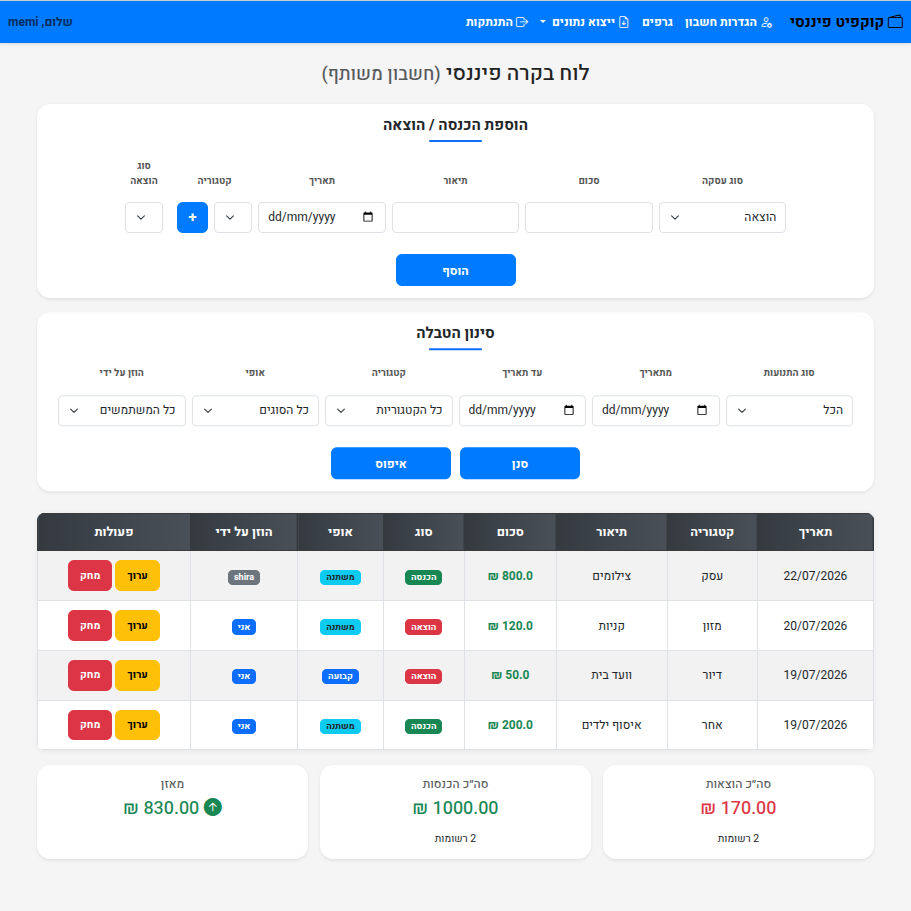

# Financial Cockpit
### Personal Finance Management Platform

A full-stack personal finance management platform built with Python and Flask.

Financial Cockpit enables users to manage income and expenses, monitor financial activity through interactive dashboards, generate reports, export financial data, and collaborate using shared accounts.

```markdown
## 🚀 Highlights

- Full-stack web application
- Modular Flask architecture
- Authentication & authorization
- Financial dashboards
- Shared accounts
- SQL database design

## 📷 Screenshots

### Dashboard



### Charts


### Transactions


## ✨ Key Features

- Secure authentication
- Income & expense management
- Shared accounts
- Interactive dashboard
- Financial charts
- Reports
- Advanced filtering
- Excel & CSV export
- Role-based access control

---

## Architecture

The project is built using a layered architecture approach.

     Browser
        │
        ▼
   Flask Routes
        │
        ▼
  Business Logic
        │
        ▼
 Repository Layer
        │
        ▼
  SQLite Database

### Routes Layer

Responsible for handling HTTP requests, user interactions, and application endpoints.

Examples:

* Authentication routes
* Income routes
* Expense routes
* Dashboard routes

### Services Layer

Contains the business logic of the application.

Responsible for:

* Processing financial operations
* Applying application rules
* Connecting between routes and data access layers

### Repositories Layer

Responsible for communication with the database.

Handles:

* Data retrieval
* Data insertion
* Data updates
* Database queries

### Utilities Layer

Contains reusable helper functions such as:

* Authentication utilities
* Permission handling
* Shared application logic

### Database Layer

The project uses SQLite as the database system.

Database structure is managed through:

```
schema.sql
```

---

## 🛠 Tech Stack

### Backend

- Python
- Flask

### Database

- SQLite
- SQL

### Frontend

- HTML
- CSS
- Bootstrap
- Jinja2

### Data

- Pandas
- NumPy

### Tools

- Git

---

## Project Structure

```
Financial-Cockpit/

├── app.py
├── config.py
├── db.py
├── schema.sql
│
├── routes/
├── services/
├── repositories/
├── utils/
│
├── templates/
└── static/
```

---

## Installation & Running

### Clone the repository

```bash
git clone https://github.com/memi770/financial-cockpit.git
```

### Create virtual environment

```bash
python -m venv .venv
```

Activate the environment:

Linux:

```bash
source .venv/bin/activate
```

Windows:

```bash
.venv\Scripts\activate
```

### Install dependencies

```bash
pip install -r requirements.txt
```

### Run the application

```bash
python app.py
```

The application will be available at:

```
http://127.0.0.1:5000
```

---


## Future Improvements

Possible future enhancements:

* Migration to a production database such as PostgreSQL
* Deployment to a cloud environment
* Additional financial reports
* Improved user interface
* Automated testing
* Docker support
* REST API
* Unit testing
* CI/CD pipeline

```
```
Developed as the final project for the Practical Software Engineering diploma.
